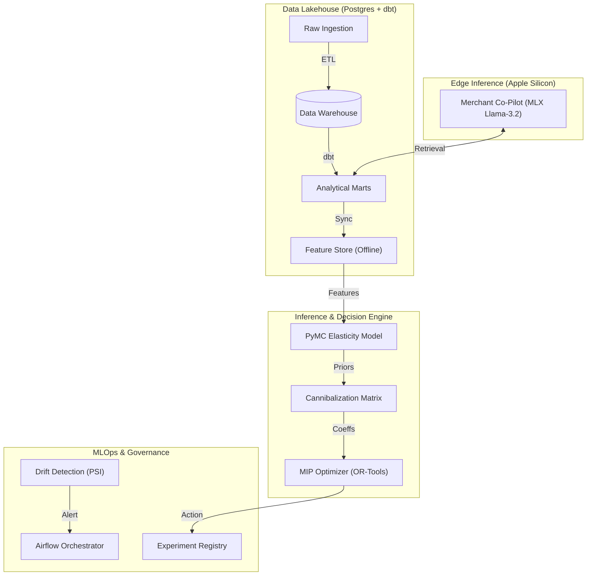

# PIRO: Autonomous Pricing & Revenue Optimization Platform

**Status**: Production-Ready (Sprint 10 Complete)  
**Authors**: Senior Data Science Team  
**Architecture**: Hybrid Lakehouse (Docker Core) + Edge AI (Apple Silicon)

---

## 1. Executive Summary & Business Impact

Retail pricing is traditionally a battle between **Merchant Intuition** and **Black-Box Algorithms**. PIRO bridges this gap by delivering a **Glass-Box Autonomous Pricing Engine**.

Unlike standard regression models that output point estimates, PIRO utilizes **Hierarchical Bayesian Inference** to quantify uncertainty in consumer demand. It couples this with **Causal Inference** to validate pricing actions and **GenAI** to explain decisions in plain English to category managers.

### 🚀 Key Performance Indicators (SDR Category)
- **Profit Uplift**: identified a **+7.2%** profit opportunity via constraint-based optimization (MIP).
- **Cannibalization**: Quantified a **+0.16** cross-elasticity between *Coke* and *Pepsi*, preventing revenue-neutral portfolio churn.
- **Model Confidence**: Synthetic Control experiments achieved **$R^2 = 0.88$** on pre-period validation, ensuring trustworthy lift measurement.

---

## 2. Scientific Methodology

PIRO is built on three pillars of advanced decision science:

### A. Bayesian Demand Modeling (PyMC)
We move beyond `Price = Slope * Demand` by modeling the entire probability distribution of elasticity:
-   **Hierarchical Priors**: Information sharing across similar UPCs (Partial Pooling) allows robust inference even for low-volume SKUs.
-   **Uncertainty Quantification**: Pricing decisions are risk-adjusted using the posterior distribution of elasticities.

### B. Causal Validation (Synthetic Controls)
A/B testing is difficult in brick-and-mortar retail due to store heterogeneity.
-   **Method**: We use **Lasso Regression** to construct a "Synthetic Control" store—a weighted combination of unaffected stores that perfectly mimics the treatment store's pre-intervention behavior.
-   **Outcome**: Accurately measures the **Incremental Lift** of a price hack, isolating it from seasonality and trend.

### C. Constraint-Based Optimization (OR-Tools)
We do not just predict; we optimize.
-   **Technique**: Mixed-Integer Programming (SCIP Solver).
-   **Objective**: Maximize $\sum (Price - Cost) \times Demand$.
-   **Constraints**:
    -   Maintain Category Revenue $\ge$ 95% of baseline.
    -   Price ladders (e.g., *Brand A* > *Private Label*).

### D. The Reasoning Engine (GenAI/MLX)
To gain merchant trust, we deploy a **Llama-3.2 Co-Pilot** on edge hardware (Apple Silicon).
-   **RAG**: The agent retrieves real-time elasticity context and competitive indices.
-   **Chain-of-Thought**: Explains *why* a price cut is recommended (e.g., *"Elasticity is -2.4, so volume gain will offset margin loss"*).

---

## 3. Production Architecture

The platform follows a **Modern Lakehouse** pattern with a **Hybrid Inference** layer.



### Engineering Standards
-   **Feature Store**: Point-in-Time correctness prevents training-serving skew.
-   **Drift Detection**: Automated **Population Stability Index (PSI)** checks trigger retraining if market dynamics shift (e.g., Inflation PSI > 0.2).
-   **Orchestration**: Apache Airflow manages the dependency graph (Ingest -> Transform -> Train -> Optimize).

---

## 4. Developer Runbook

### Prerequisites
-   **Docker Desktop** (Core Platform)
-   **Python 3.11** (Local MLX Environment)

### Step 1: Initialize the Platform
```bash
make up   # Starts Postgres, Metabase, MinIO
make all  # Runs Ingestion and dbt transformations
```

### Step 2: Run the Science Loop
```bash
# 1. Train Bayesian Model
docker compose exec runner python ml/elasticity/train_model.py --category sdr

# 2. Run Optimization
docker compose exec runner python ml/optimization/optimize_profit.py --category sdr
```

### Step 3: Run MLOps Pipeline
```bash
# Check for Data Drift (Training vs Serving)
docker compose exec runner python ml/ops/drift.py --train_start 1990-01-01 --serve_end 1993-01-01

# Register a Pricing Experiment
docker compose exec runner python ml/experimentation/register_experiment.py --name "Hike Test" --store 9
```

### Step 4: Launch the GenAI Co-Pilot (Mac Metal)
To utilize the Neural Engine:
```bash
# Create Local Env
python3 -m venv .venv_mlx
source .venv_mlx/bin/activate
pip install mlx-lm sqlalchemy psycopg2-binary

# Ask a Strategic Question
python ml/copilot/agent.py --query "Should we lower the price of Diet Pepsi to steal share from Coke?"
```

---

## 5. Technology Stack

| Domain | Technology | Implementation |
| :--- | :--- | :--- |
| **Warehouse** | **PostgreSQL 15** | Star Schema, JSONB for unstructured logs. |
| **Transformation** | **dbt Core** | Modular SQL, Data Tests, Documentation. |
| **Probabilistic ML** | **PyMC** | NUTS/ADVI Samplers for Bayesian Inference. |
| **Optimization** | **Google OR-Tools** | Mixed-Integer Programming (SCIP). |
| **Causal Inference** | **Scikit-Learn** | Lasso Regression for Synthetic Controls. |
| **GenAI** | **MLX (Apple)** | Quantized 4-bit Inference on Metal GPU. |
| **Orchestration** | **Apache Airflow** | DAG-based workflow management. |
| **Serving** | **FastAPI** | Async REST Endpoints. |

---

*Confidential Property of PiRo Data Science Team.*
