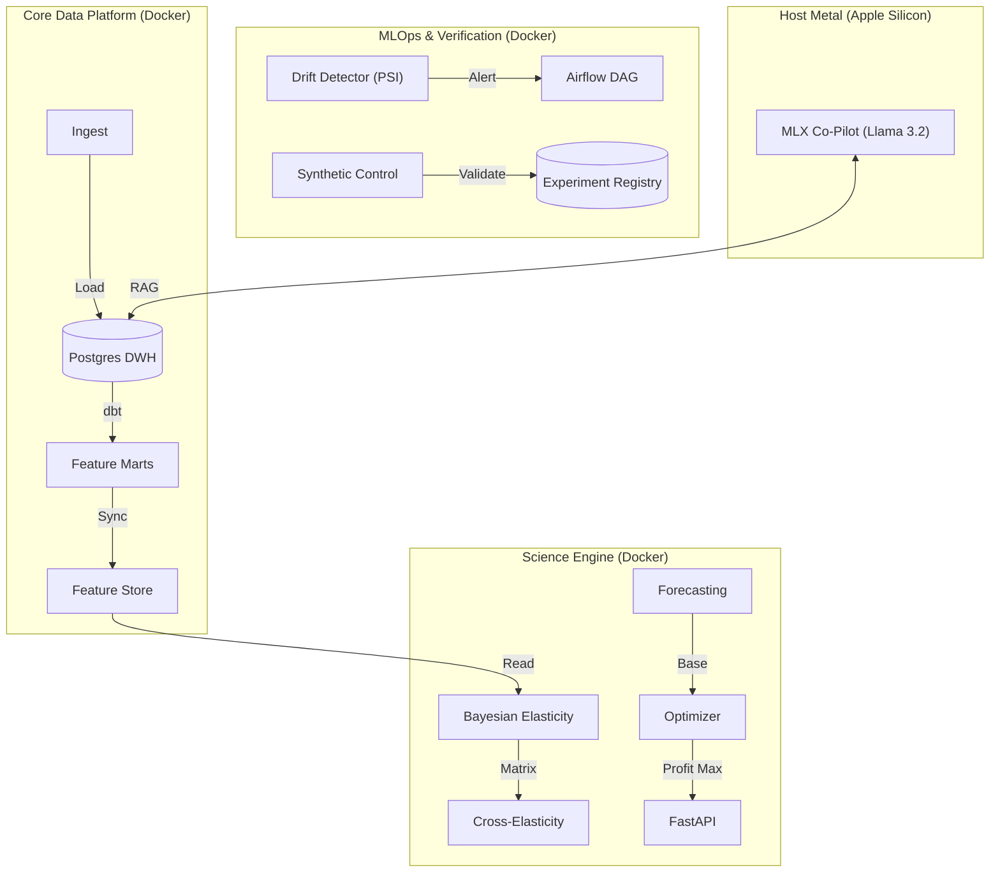

# PIRO: Price Intelligence & Revenue Optimization Platform

**Status**: Completed (Sprint 6)

PIRO is an industry-grade pricing engine leveraging the **Dominick's Finer Foods (DFF)** dataset (provided by the Kilts Center for Marketing). It implements a modern Lakehouse architecture with Bayesian Elasticity Modeling, Probabilistic Forecasting, and Constraint-Based Optimization to deliver actionable pricing recommendations.

---

## 1. Executive Summary

Retail pricing is often driven by intuition rather than data. PIRO solves this by scientifically measuring price sensitivity (elasticity) and simulating outcomes to optimize revenue and profit.

**Key Capabilities**:
- **Pricing Engine**: Hierarchical Bayesian models estimate elasticity at the Store/UPC level.
- **Forecasting**: Probabilistic demand forecasting using AutoARIMA.
- **Optimization**: Mixed-Integer Programming (MIP) to find optimal price points under global business constraints.
- **Simulation**: "What-if" analysis for price changes (e.g., impact of a 10% hike).

---

## 2. Quantitative Results

The platform has been trained and validated on the **Soft Drinks (SDR)** category.

### 📊 Model Performance
| Metric | Value | Interpretation |
| :--- | :--- | :--- |
| **Average Elasticity** | **-1.17** | Demand is elastic; a 10% price drop typically yields >11.7% volume lift. |
| **Promo Lift** | **+224%** | Promotions are highly effective, tripling baseline volume on average. |
| **Profit Optimization** | **+7.2%** | The optimizer identified a potential **7.2% increase in category profit** while maintaining 95% revenue. |

> *Note: Metrics derived from the `elasticity_catalog` and `optimization_results` tables for the SDR category.*

---

## 3. System Architecture



### Component Breakdown
1.  **Core Platform**:
    -   **warehouse**: Postgres 15 + dbt (Star Schema).
    -   **feature_store**: Point-in-Time correct features for training/serving consistency.
2.  **Science Engine**:
    -   **Elasticity**: PyMC Hierarchical Log-Log (Own & Cross Elasticity).
    -   **Optimization**: MIP Solver (SCIP) penalizing cannibalization.
3.  **MLOps**:
    -   **Drift**: PSI-based monitoring (`ml/ops/drift.py`).
    -   **Experiments**: Synthetic Control Engine (`ml/experimentation`).
    -   **Automation**: Airflow DAGs (`dags/`).
4.  **GenAI Agent**:
    -   **Local**: Python 3.11 (`.venv_mlx`) running on Metal Performance Shaders (MPS).
    -   **Model**: Quantized Llama-3.2-3B for RAG-based pricing explanation.

---

## 4. Setup & Usage

### Prerequisites
-   Docker & Docker Compose
-   Python 3.9+ (if running locally without Docker)
-   DFF Dataset (Stata/CSV files) placed in `data/raw/`

### Quick Start
1.  **Start Services**:
    ```bash
    make up
    # Starts Postgres (5432), Metabase (3000), MLflow (5001), Minio (9000)
    ```

2.  **Run Data Pipeline**:
    ```bash
    make all
    # Ingests data -> Runs dbt transformations -> Runs Tests
    ```

3.  **Run Science Engine**:
    ```bash
    # Train Elasticity Model
    docker compose exec runner python ml/elasticity/train_model.py --category sdr

    # Generate Forecasts & Simulation
    docker compose exec runner python ml/forecasting/train_forecast.py --category sdr
    docker compose exec runner python ml/simulation/scenario_engine.py --category sdr
    ```

4.  **Run Optimization**:
    ```bash
    # Find profit-maximizing prices
    docker compose exec runner python ml/optimization/optimize_profit.py --category sdr
    ```

5.  **Start API**:
    ```bash
    docker compose exec -d runner uvicorn api.main:app --host 0.0.0.0 --port 8000
    ```

### API Endpoints
-   `GET /v1/optimize/sdr`: Get list of recommended price changes.

### 🍎 Mac M1/M2/M3 Setup (Native GLM)
To run the GenAI Co-Pilot with hardware acceleration:
1.  **Create venv**:
    ```bash
    python3 -m venv .venv_mlx
    source .venv_mlx/bin/activate
    pip install mlx-lm sqlalchemy psycopg2-binary
    ```
2.  **Run Agent**:
    ```bash
    python ml/copilot/agent.py --query "Why did we hike the price of Coke?"
    ```

---

## 5. Technology Stack

-   **Language**: Python 3.9
-   **Database**: PostgreSQL 15
-   **Transformation**: dbt Core 1.7
-   **Machine Learning**:
    -   **PyMC**: Bayesian Inference.
    -   **StatsForecast**: Efficient Time Series Forecasting.
    -   **OR-Tools**: Operations Research / Optimization.
-   **Serving**: FastAPI, Uvicorn.
-   **Infrastructure**: Docker, Docker Compose, MinIO (S3-compatible storage).
